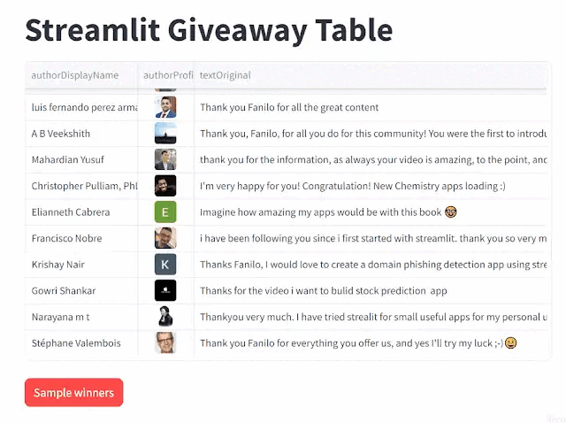

# Streamlit Book Giveaway code

App to download all Youtube comments from a video_id and select 5 as winners



## Prerequisites

### Enable Youtube API

- Go to [Google Console](https://console.cloud.google.com/) for the Google account linked to your Youtube.
- Create a new dedicated GCP project
- In [the library panel](https://console.cloud.google.com/apis/library), enable `Youtube Data API v3` and `Youtube Analytics API`
- From the [credentials panel](https://console.cloud.google.com/apis/credentials), set up an API Token and an OAuth 2.0 client ID.
- Download the JSON file that contains your OAuth 2.0 credentials. It should be named `client_secret_CLIENTID.json`, I renamed it `client_secret.json` in this project. Put it at the root of the project, as I hardcoded the path ^^'

### Create Python Environment

```sh
conda create -n st-giveaway python=3.9
conda activate st-giveaway
pip install -r requirements.txt
```

## Run

```sh
streamlit run st_giveaway.py
```

On startup, a new browser tab should open with the Youtube authentication screen.

## Resources

- [Python Quickstart to Youtube Data API](https://developers.google.com/youtube/v3/quickstart/python#step_1_set_up_your_project_and_credentials).
